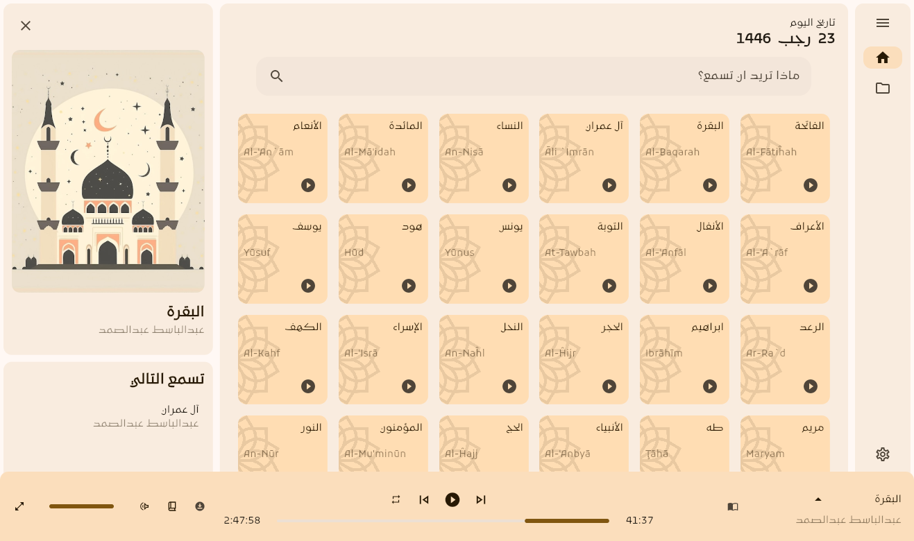
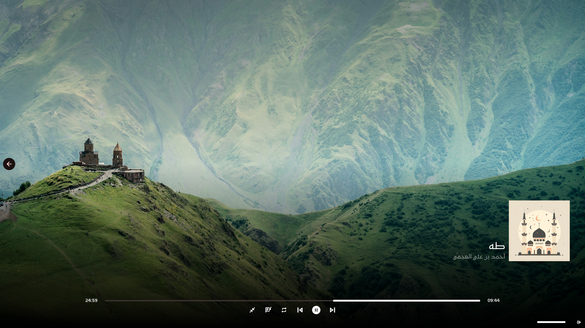
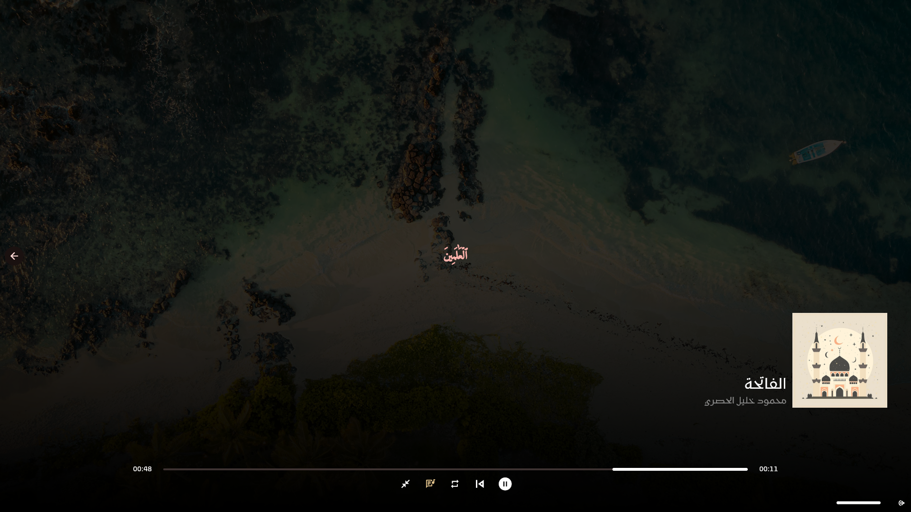
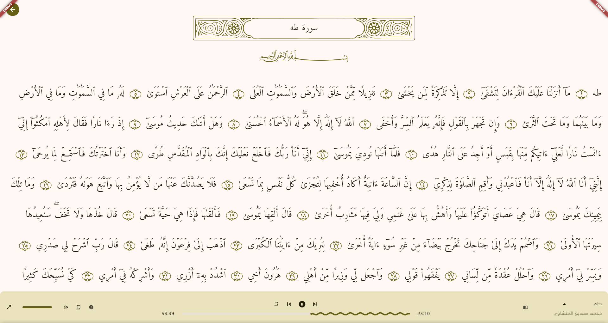
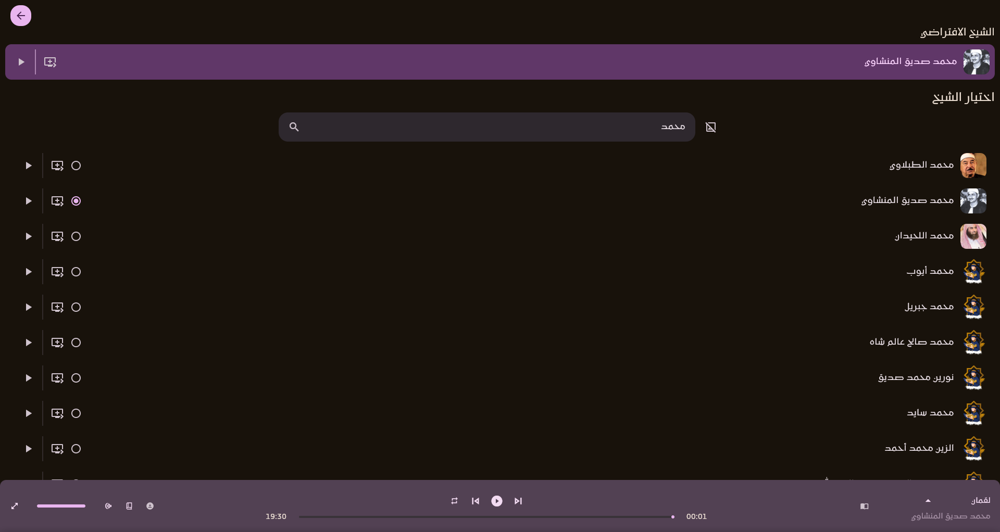

# Mostaqem
[![style: very good analysis][badge]][badge_link]

 An app for Islamic media like quran and podcasts without ads and subscriptions







# Getting Started
## Dependencies

Make sure to install `mpv libmpv-dev` for debian/ubuntu
```
sudo apt install mpv libmpv-dev
```
For arch

[Download AUR Package](https://aur.archlinux.org/packages/mostaqem)


## Features:
* Listening and read quran
* Search for chapters (Surah)
* Change Reciters
* Integrated with Discord
* Shortcuts Help
* Fullscreen mode
* Integrated with OS
    * Windows
        * Taskbar buttons
        * [System Media Transport Controls][SMTC]
    * Linux
        * Mpris
* Offline Mode
    * Download manager
    * Custom download path
* Recitations
* Customization


## Credits:
- [Omar Sabra](https://github.com/the-sabra) | Backend Engineer
- [Islam Khalil](https://github.com/islam-khalil0) | Web Developer
- [Me](https://github.com/mezopeeta) | Flutter
- [MP3Quran](https://mp3quran.net/ar/api) | API we used for audio
- [Unsplash](https://unsplash.com/developers) | API for generating random image for the fullscreen mode

## License:
- This project is licensed under the [Mostaqem Custom License (MCL)](LICENSE) © Mazen Omar - see the LICENSE.md file for details

## Acknowledgments
- Inspired by [Spotify](https://open.spotify.com/)

<!-- end:excluded_rules_table -->
[badge]: https://img.shields.io/badge/style-very_good_analysis-B22C89.svg
[badge_link]: https://pub.dev/packages/very_good_analysis
[SMTC]: https://learn.microsoft.com/en-us/windows/uwp/audio-video-camera/system-media-transport-controls
