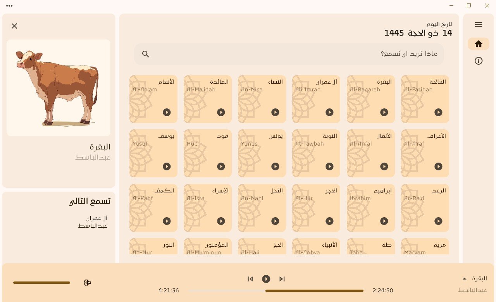

# Mostaqem
 An app for Islamic media like quran and podcasts without ads and subscriptions

 * Beta releases will be released on our github releases
 * Stable releases will be released on the store such as Microsoft store for automatic updates

# Getting Started
## Dependencies
for the linux version u need the following dependencies to be installed:
* mpv
* libmpv-dev

for Ubunut/Debian , simple run 
```
sudo apt install mpv libmpv-dev
```

## Screenshot


## Features:
* Listening and read quran
* Search for chapters (Surah)
* Change Reciters
* Integrated with Discord
* Shortcuts Help
* Fullscreen mode
* Integrated with OS


### TODOs:
- [ ] Add to Favorites
- [ ] Make your own playlist
- [ ] Categorize home page with filter option
- [ ] Share your playlist with friends
- [ ] Listen together
- [ ] Add your Reciter
- [ ] Download

## Credits:
- [Omar Sabra](https://github.com/the-sabra) | Backend Engineer
- [Me](https://github.com/mezopeeta) | Flutter
- [MP3Quran](https://mp3quran.net/ar/api) | API we used for audio
- [Quran Foundation](https://api-docs.quran.com/docs/category/quran.com-api) | API we used for reading

## License:
- This project is licensed under the [GNU-V3](LICENSE) © Mazen Omar - see the LICENSE.md file for details

## Acknowledgments
- Inspired by [Spotify](https://open.spotify.com/)